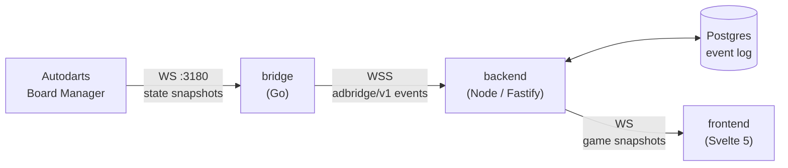

# Architecture

dartcade talks directly to each board's local Autodarts **Board Manager**, not to the Autodarts
cloud. A small bridge next to the board turns Board Manager's raw state snapshots into clean dart
and takeout events. The backend runs the games on those events and pushes the match to every
browser that's watching.

## Components

| Component | Path | What it does |
|---|---|---|
| **Bridge** | [`bridge/`](bridge) | A single Go binary that runs next to the board. It connects to Board Manager, diffs its state snapshots into typed `adbridge/v1` events (`dart.detected`, `takeout.finished`, …) and streams them to the backend over WSS with seq/ack delivery. It pairs with a backend through a short code. |
| **Backend** | [`backend/`](backend) | A Fastify server with an event-sourced session engine, the game modules, a gateway for bridges, a WebSocket gateway for browsers and a REST API. It serves the SPA from the same process. |
| **Frontend** | [`backend/frontend/`](backend/frontend) | A Svelte 5 SPA: sign in, pair and manage boards, set up games, play, look back at history. One codebase for desktop and phone. |
| **Schema** | [`schema/`](schema) | Hand-written contracts, generated into TypeScript, zod and Go. See [Contracts](#contracts). |

## Games are reducers over an event log

Every game is a pure reducer. Its inputs are the board events and the players' actions (manual
darts, corrections, undo, next player). The backend stores each game's inputs in Postgres in order
and folds them into the game's state. So:

- **A game survives a restart.** On startup the backend replays each running game's input log.
- **Corrections are clean.** A corrected dart replays the open visit from its start, so a game
  module only ever moves forward.
- **Games are deterministic.** Anything random (Around the Clock's random order, a random throw
  order) comes from a seed stored with the game.

A game module (`backend/src/games/`) supplies its setup (`init`, default config and the setup
form), how it reacts to board events and player actions, the view it sends to browsers, and what
the history shows (placements, stats, per-mode detail). `withBullOff` wraps any game in a bull off
that decides the throwing order. [`AGENTS.md`](AGENTS.md) has the step-by-step for adding a game.

A game can opt into **teams** (`teams: true`, `teamsOf`) so two teams share one score instead of
every seat playing for itself; each seat still keeps its own controller, board and stats. The
shared rules — turn order across teams, team placements, forfeits — live in
`backend/src/games/teams.ts`, so any game adds teams without writing its own.

After every change the backend pushes a snapshot of the game to each browser that has it open.
Snapshots are built per viewer (which seats are yours, who is connected), and the browser checks
each one against the schema before showing it.

## Several players, several boards

Every game starts from a **lobby**: a private room that holds the game's settings and who's
playing, and stays open between games. Playing alone is a lobby with just you in it, and it stays
out of the way until someone else joins by invite, code, link or QR.

A game has **seats**. Each seat has a name, the account that controls it, and the board it throws
on, if any. One host can run every seat at one board, or seats can belong to other accounts
playing from their own devices and boards.

- Board events count only for the seat that's up. A dart on another seat's board is dropped, and
  that board's players get a "not your turn" notice.
- Only a seat's controller acts for it. The host ends the game for everyone; anyone else leaves,
  forfeiting their own seats.
- The match screen tracks who has the game open and since when someone is gone, so everyone sees
  "waiting for…". A board whose bridge is offline falls back to manual entry for its player.

The design and its decisions, including the lobby model, are in
[`docs/superpowers/specs/2026-10-02-online-multiplayer-design.md`](docs/superpowers/specs/2026-10-02-online-multiplayer-design.md).

## Camera view

The match screen can show a camera's picture of the real board instead of the drawn one (a
per-device setting: SVG, Cam 1–3). After each dart, correction, takeout and resync the bridge
fetches a still from each camera, straightened by Board Manager (`/api/img/cams/{i}?warp=true`:
bull at the centre, the double wire at a third of the width, 20 at the top, which is the board's
own coordinate system), and sends it up its connection as a `camera.still` message: not an event,
never stored or replayed. The backend keeps the latest still per board and camera in memory,
tells the game's pages on the game socket (`camera`, with a version), and serves it at
`GET /api/boards/{id}/camera/{i}` to anyone who may watch the board's game. It forgets a board's
stills when its bridge drops or the board is deleted; the bridge sends fresh ones on every
connect. These pictures only ever travel through the bridge, so this works whether or not the
backend can reach the board's network. The one exception is the owner's live preview on the
Boards page, `GET /api/boards/{id}/camera/{i}/live`: the backend fetches the raw frame from the
Board Manager itself (only from the http(s) origin the bridge reported), so it only works on the
board's network and is turned off with `BOARD_LIVE_CAMERA=off`. Design: [`docs/superpowers/specs/2026-10-04-camera-view-design.md`](docs/superpowers/specs/2026-10-04-camera-view-design.md).

## Contracts

`schema/` holds the contracts. Generated files are committed and never edited by hand
(`npm run gen:api` at the repo root; see [`DEVELOPMENT.md`](DEVELOPMENT.md)).

| File | Between | Generated into |
|---|---|---|
| `adbridge-v1.json` | bridge → backend events and camera stills | TypeScript types (`backend/src/schema/types.ts`), zod schemas, Go types (`bridge/internal/schema`) |
| `api-v1.yaml` (OpenAPI 3.0.3) | HTTP API for the frontend and the bridge | TypeScript types and client, Go client for the bridge |
| `game-ws-v1.json` | game WebSocket: snapshots, notices, camera stills, user actions | TypeScript types and zod schemas (backend and frontend) |
| `common-v1.json` | shared definitions | — |

[`schema/diff-rules.md`](schema/diff-rules.md) describes how the bridge turns Board Manager
snapshots into events.

## Persistence

Postgres through Kysely, with plain SQL migrations in `backend/src/db/migrations/`:

- the accounts and sessions of better-auth
- boards and their hashed bridge tokens
- games, their seats and their input logs, plus the raw bridge events for debugging
- each game's result, written when it ends, for the history

## Further reading

- [`docs/architecture.md`](docs/architecture.md): the original research. It covers what the Board
  Manager's local API exposes, the transport and event design, and the risks and open questions.
- [`docs/superpowers/specs/`](docs/superpowers/specs) and
  [`docs/superpowers/plans/`](docs/superpowers/plans): feature specs and their implementation plans.
- [`AGENTS.md`](AGENTS.md): a map of where everything lives in the code.
