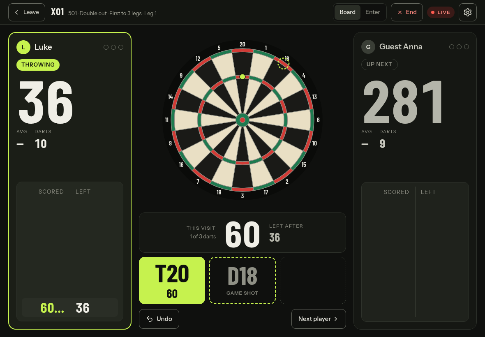
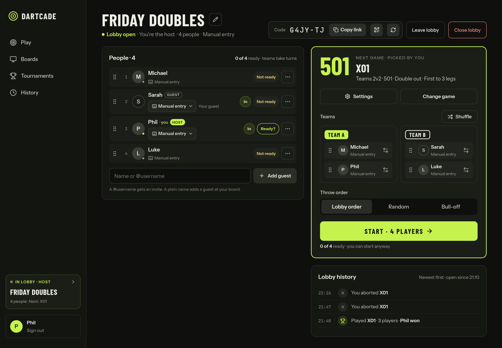

  

<h1 align="center">dartcade</h1>

  <strong>More games for your Autodarts board. Free and open source.</strong>

  
  
  

---

dartcade turns the board you already run [Autodarts](https://autodarts.io) on into a full arcade
— free and open source, no new hardware. Play the classics, plus modes Autodarts doesn't have:
team games, your own rules, more on the way. Play side by side at one board, or against friends
at their own boards across town, from a computer, tablet or from your phone.

## Screenshots

  
  

## Getting started

**[→ Get dartcade running on your board](GETTING_STARTED.md)**

## Features

### Games

- **X01**: 301, 501, 701 and more, singles or Team A vs Team B, with the usual rule variants.
- **Around the Clock**: race around 1–20, with a few variants of its own.

### Playing

- **Hands-free on your board**, or enter darts yourself by tap or keypad — with easy dart correction via mouse or touch.
- **Modern match screens**: scores, averages, a chalkboard, checkout suggestions
  and leg dots, on desktop or phone.
- **A caller for X01**, with a built-in voice or your own imported voice pack.
- **Online lobbies**, invite friends and play across boards.
- **Friends**, with requests and live online status, so you always know who's up for a game.

### Boards and history

- **Pair a board with a code**, then run it from dartcade — status, start, stop, reset, calibrate.
- **See the real board**, drawn from a camera on your board instead of a generic one.
- **Every game kept**, with results and stats to look back on.

## Coming next

- **Matchmaking** with ratings.
- **More minigames**, such as soccer and challenge modes.

## Learn more

- [`GETTING_STARTED.md`](GETTING_STARTED.md): deploy the app and install the bridge.
- [`DEVELOPMENT.md`](DEVELOPMENT.md): run it yourself, connect a board, run the tests.
- [`ARCHITECTURE.md`](ARCHITECTURE.md): how the bridge, backend and frontend fit together.

## License

dartcade is licensed under [AGPL-3.0](LICENSE).
