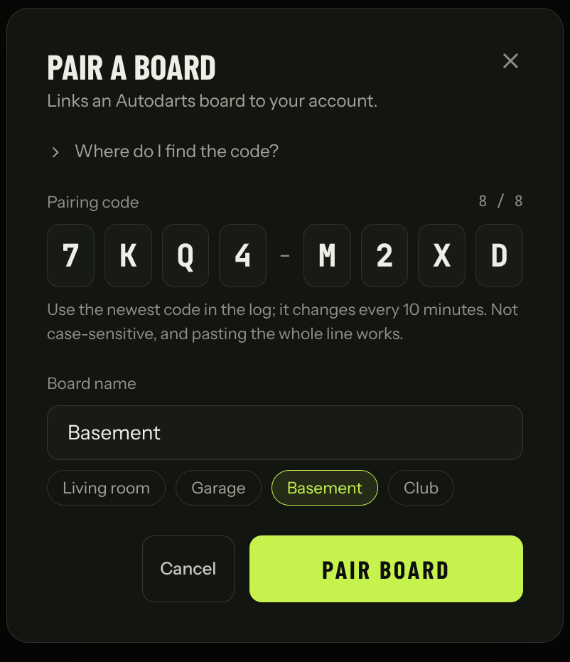
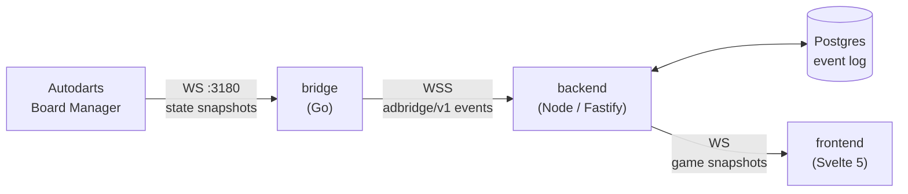

<p align="center">
  
</p>

<h1 align="center">dartcade</h1>

<p align="center">
  <strong>Custom dart minigames for physical boards running <a href="https://autodarts.io">Autodarts</a>.</strong>
</p>

<p align="center">
  <a href="https://github.com/W3D3/dartcade/actions/workflows/ci.yml"></a>
</p>

---

dartcade talks directly to your board's local Autodarts **Board Manager**, turns its raw state snapshots into clean dart and takeout events, and runs its own game engine on top. You get game modes Autodarts doesn't ship, a live match display in the browser, and full control over the rules.

## Contents

- [Features](#features)
- [How it works](#how-it-works)
- [Quick start](#quick-start)
- [Connecting a board](#connecting-a-board)
- [Development](#development)
- [Documentation](#documentation)
- [Status](#status)

## Features

**Game modes**

- **Around the Clock** — hit 1–20 in order (ascending, descending or random), finish on 20, single bull or bull, optional multiplier skipping and "throw again" when all three darts hit.
- **X01** — 301 / 501 / 701 with straight, double or master in/out, WDC or PDC bull-off, 25/50 or 50/50 bull, max rounds and first-to-N legs.

**Playing**

- Live match screen with a dartboard view, player cards, checkout hints and leg dots.
- Correction panel for fixing a misdetected dart (quick or full correction).
- Manual dart entry, so you can play without a board or step in when the camera misses.
- Sound effects and per-game settings.

**Boards**

- Pair a board by typing the code the bridge prints on startup — no config files to copy around.
- Board panel showing Board Manager status, with start, stop, reset and calibrate controls and a camera preview.

<p align="center">
  
</p>

## How it works



| Component | Path | What it does |
|---|---|---|
| **Bridge** | [`bridge/`](bridge) | Single Go binary that runs next to the board. Connects to Board Manager, diffs state snapshots into typed `adbridge/v1` events and streams them to the backend over WSS with seq/ack delivery. |
| **Backend** | [`backend/`](backend) | Fastify server with an event-sourced session engine, game modules, a bridge gateway, a browser WebSocket gateway and a REST API. Serves the SPA from the same process. |
| **Frontend** | [`backend/frontend/`](backend/frontend) | Svelte 5 SPA for creating sessions, running matches and managing boards. |
| **Schema** | [`schema/`](schema) | Hand-written contracts, generated into TypeScript and Go: the `adbridge/v1` JSON Schema shared by bridge and backend, an OpenAPI 3.0.3 spec (`api-v1.yaml`) for the HTTP API used by the frontend and bridge, and a JSON Schema (`game-ws-v1.json`) for the game WebSocket, plus shared defs in `common-v1.json`. |

Every game is a pure reducer over the event log, so sessions survive restarts and dart corrections replay cleanly.

## Quick start

You need **Docker** and an Autodarts board reachable on your LAN.

```bash
cp .env.example .env
# set DARTCADE_BOARD_URL to your board, e.g. http://192.168.1.42:3180
docker compose -f docker-compose.dev.yaml up --build
```

Open <http://localhost:5173>, pick your board, add players and start a game.

No board? Create a session without one and enter darts manually.

## Connecting a board

In production the bridge runs on a machine on the same network as the board (often the board PC itself) and connects out to your dartcade backend.

1. Download the bridge for your platform from [GitHub Releases](https://github.com/W3D3/dartcade/releases) (Linux, macOS and Windows builds are published for every `v*` tag), or use the `ghcr.io/w3d3/dartcade-bridge` image.
2. Start it:
   ```bash
   dartcade-bridge --board-url http://<board-ip>:3180 --backend-url wss://<your-dartcade-host>
   ```
3. With no token configured, the bridge prints a pairing code such as `7KQ4-M2XD`.
4. In dartcade, open **Boards → Pair a board**, enter the code and give the board a name.

The bridge saves its token and pairs automatically from then on. Run `dartcade-bridge --help` for all options.

## Development

The project uses [mise](https://mise.jdx.dev) for tool versions (Node 22, Go 1.23) and tasks:

```bash
mise run dev          # full dev stack with hot reload
mise run test         # backend, frontend and bridge tests
mise run gen:types    # regenerate adbridge/v1 TS types from the schema
mise run gen:api      # regenerate HTTP/WS types and clients from schema/ (or: npm run gen:api)
```

`npm ci` at the repo root installs the tools `gen:api` needs (`@redocly/cli`, `openapi-typescript`, …); `npm run lint:api` validates `schema/api-v1.yaml`. Once the backend is running, `/api/docs` serves a Swagger UI for both our API and better-auth's.

The backend tests need a running Postgres. See [`DEVELOPMENT.md`](DEVELOPMENT.md) for setup, environment variables, the repository layout and production builds.

## Documentation

- [`DEVELOPMENT.md`](DEVELOPMENT.md) — local setup, tests and builds
- [`docs/architecture.md`](docs/architecture.md) — design, Board Manager API findings and the event schema
- [`schema/diff-rules.md`](schema/diff-rules.md) — how the bridge turns snapshots into events
- [`docs/superpowers/`](docs/superpowers) — feature specs and implementation plans

## Status

dartcade is in active development. Bridge, backend and frontend are all working end to end, with Around the Clock and X01 playable today. More minigames, such as soccer and challenge modes, are planned.
