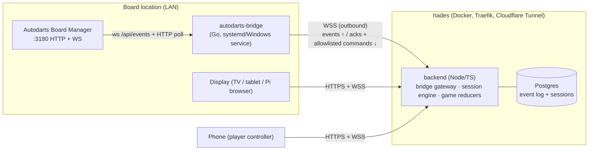
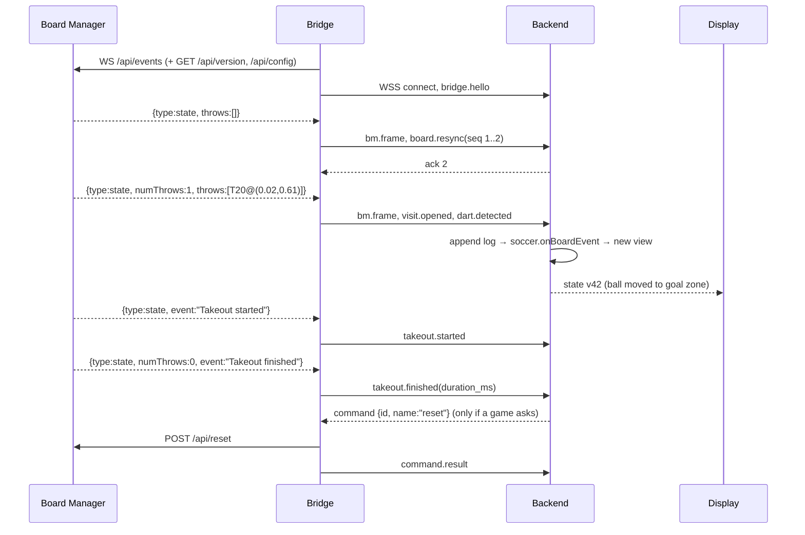

# Autodarts minigames: architecture plan

Status: **design draft, nothing implemented yet**. Researched 2026-09-24.

Custom dart minigames (soccer, challenges, similar to Dartom) on physical boards that use
Autodarts computer vision. The system talks to each board's local **Board Manager** directly
and does not use darts-caller, darts-extern or darts-hub.

Contents:
1. [TL;DR](#1-tldr)
2. [What the Board Manager local API actually exposes](#2-what-the-board-manager-local-api-actually-exposes)
3. [Review of the stated architecture](#3-review-of-the-stated-architecture)
4. [Components and technology choices](#4-components-and-technology-choices)
5. [Internal event schema (`adbridge/v1`)](#5-internal-event-schema-adbridgev1)
6. [Data flow](#6-data-flow)
7. [Deployment](#7-deployment)
8. [Risks and open questions](#8-risks-and-open-questions)
9. [Suggested first steps](#9-suggested-first-steps)
10. [Sources](#10-sources)

---

## 1. TL;DR

- **Spatial data is available locally.** Each detected dart in Board Manager's state carries
  `coords: {x, y}` as well as the scored `segment`. I checked all five published live
  samples against dartboard geometry. The coordinates are **centred on the bull, with radius
  1.0 at the outer double wire, x pointing right and y pointing up** (details in §2.4). Soccer
  zone mapping can therefore live in the backend as planned. This is not a blocker.
- **The local API sends board state, not throw events.** `ws://<board>:3180/api/events`
  pushes a full `state` snapshot (`status`, `event`, `numThrows`, `throws[]`) whenever
  something changes. There is no "dart N landed" message, no dart ID, no timestamp and no
  sequence number. A dart already reported can also **change afterwards** (a correction).
  Someone has to compare each snapshot with the previous one to work out what happened, and
  the rule engine has to cope with darts being revised. That shapes most of the schema.
- **No timestamps come from Board Manager.** The bridge has to stamp every frame when it
  arrives (wall clock and monotonic clock). Otherwise takeout timing and similar data are
  lost for good.
- **Your architecture stands, with three changes:**
  1. The bridge works out dart and takeout events (protocol normalisation, still no game
     logic) **and** forwards every raw frame unchanged.
  2. The bridge→backend link needs a **narrow downstream command channel**, mainly
     `POST /api/reset`. The bridge still opens the connection, but messages flow both ways.
  3. "Forward everything unfiltered" needs **one exception: secrets**. `/api/config`
     returns the board's cloud `api_key`.
- **Cloud API: skip it for v1.** Autodarts replaced Keycloak with its own OAuth service
  (`api.autodarts.io/auth/v1`). The password grant is gone, and third-party clients need a
  client ID that Autodarts approves by hand. Local detection does not need the cloud.
- **Stack:** Go single-binary bridge (systemd/Windows service, `curl | bash` installer like
  Autodarts' own) → JSON over WSS with sequence numbers and acknowledgements → TypeScript
  (Node) backend with pure per-game reducers over an append-only event log in Postgres →
  Svelte SPA frontend over WebSocket. The backend runs on hades behind the Cloudflare Tunnel.

---

## 2. What the Board Manager local API actually exposes

Autodarts publishes no API documentation. Everything below comes from community client
source code, which I read directly rather than relying on READMEs, plus Autodarts'
changelog. The confidence column tells you how far to trust each item.

### 2.1 Transport

| Item | Finding | Confidence |
|---|---|---|
| Port | `3180`, plain HTTP and WS, reachable from other LAN hosts, not only localhost | High: every client uses it |
| Auth for local reads | None. Clients connect with no credentials. | High |
| Auth for local **writes** | None either. `PUT /api/start`, `POST /api/reset`, `PATCH /api/config` and others are unauthenticated on the LAN. | High (HACSAutodarts client) |
| Push channel | `GET ws://<host>:3180/api/events`. No subscribe message is needed; the server pushes after connect. | High: used by an ESP32 client in 2023 and HACSAutodarts in 2026, so stable across versions |
| Frame format | Text JSON envelope `{"type": <string>, "data": <object>}` | High |
| Poll fallback | `GET /api/state` returns the same shape as a `state` frame's `data` | High |
| Server keepalive / ping cadence | Not documented. HACSAutodarts uses a client heartbeat of 30 s. | Unverified |

### 2.2 WebSocket frame types seen

| `type` | `data` | Notes |
|---|---|---|
| `state` | `{connected, running, status, event, numThrows, throws[]}` | The one that matters. Sent on change. |
| `motion_state` | `{isWaiting, isStable, isDart, isHand, isTakeoutPartial, isTakeoutFull}` (booleans) | Hand and takeout motion. Useful for takeout timing. |
| `cam_state` | `{isOpened, isRunning}` | |
| `stats` | `{fps}` | Detection FPS. High-rate telemetry. |
| `cam_stats` | `{id, fps}` | Per-camera FPS. High-rate. |
| `auth`(?) | `{"token": …}` | **Unverified.** It only appears as a synthetic fixture in HACSAutodarts' tests, which check that the frame is dropped. Design for the possibility that secret-bearing frames exist. |

Treat this list as open-ended. The bridge must pass unknown `type`s through, not drop them.

### 2.3 `state` payload

Observed on Board Manager **1.0.7** (Raspberry Pi 4), from slopdarts' `API_STATE.md` and HACSAutodarts' fixtures:

```json
{
  "connected": false,
  "running": true,
  "status": "Throw",
  "event": "Throw detected",
  "numThrows": 2,
  "throws": [
    { "segment": { "name": "S1",  "number": 1,  "bed": "SingleInner", "multiplier": 1 },
      "coords":  { "x": 0.10244761711214914, "y": 0.27642075595717425 } },
    { "segment": { "name": "S11", "number": 11, "bed": "SingleOuter", "multiplier": 1 },
      "coords":  { "x": -0.6527137881738723, "y": -0.08366881784201861 } }
  ]
}
```

- `status` values (from the Board Manager frontend's switch statements, not all seen live):
  `Offline, Starting, Running, Stopping, Stopped, Throw, Takeout, Takeout in progress,
  Calibrating, Setup, Error`.
- `event` values seen in client code (ESP32 client 2023, darts-caller 2026): `Started,
  Stopped, Starting, Stopping, Throw detected, Takeout started, Takeout finished,
  Manual reset, Calibration started, Calibration finished`. Treat `event` as **free text**.
- `bed` enum: `Single, SingleInner, SingleOuter, Double, Triple, Outside`.
- **`connected` is unreliable.** It has been seen as `false` while `running: true` and a dart
  was being detected. Use `running` and `status` to tell whether detection is live.
- **Throws stay in the snapshot** after the board stops, and after a reconnect. A snapshot
  on its own cannot tell you whether a dart is new.
- **Bull and miss shapes were not seen live.** Enums suggest `name: "25"` or `"50"` for the
  bull and `bed: "Outside"` for a miss. It is unclear whether `number` is `25`, `0` or
  `null` for the bull (clients disagree). Verify this against real hardware.
- **Maximum `numThrows`: unknown.** A normal visit is 3 darts. What happens with a 4th dart
  before takeout is untested. This matters if a minigame wants more than 3 darts per visit.

### 2.4 Coordinates: checked against the published samples

slopdarts says the coordinates are "centred on the bull, normalised to 1.0 at the outer
double wire, x right and y up". The same repo's `API_STATE.md` contradicts this and calls
them "image-space 0–1". I checked the five published samples against standard board geometry
(outer double wire 170 mm, triple 99–107 mm, double 162–170 mm, wedges 18° wide with 6 at 0°
and 20 at 90°):

| Sample | (x, y) | angle | r | Expected wedge / ring | Match |
|---|---|---|---|---|---|
| S6 SingleOuter | (0.637, 0.079) | 7° | 0.64 | 6: −9…9°, r 0.63–0.95 | ✅ |
| S18 SingleInner | (0.137, 0.168) | 51° | 0.22 | 18: 45…63°, r 0.09–0.58 | ✅ |
| S20 SingleOuter | (0.067, 0.663) | 84° | 0.67 | 20: 81…99°, r 0.63–0.95 | ✅ |
| S1 SingleInner | (0.102, 0.276) | 70° | 0.29 | 1: 63…81°, r 0.09–0.58 | ✅ |
| S11 SingleOuter | (−0.653, −0.084) | 187° | 0.66 | 11: 171…189°, r 0.63–0.95 | ✅ |

All five match: **bull-centred, r = 1.0 at the outer double wire, y up**. That gives
board-relative polar coordinates, which is exactly what a zone-mapping game needs. It also
means the values come out of calibration and are not camera pixels, so they should be
comparable between boards. Caveats:

- They depend on calibration quality. A badly calibrated board places darts in the wrong
  spot.
- They jitter: coordinates can change between snapshots while the segment stays the same.
  HACSAutodarts compares segments only for that reason.
- Values above 1.0 are expected for misses. Nothing clamps them.

### 2.5 HTTP endpoints (for the bridge's metadata and commands)

| Endpoint | Use in this system |
|---|---|
| `GET /api/version` | Plain text, for example `1.0.7`. Record it with every session, and gate features on it. |
| `GET /api/config` | `auth.board_id` identifies the board. **The response also contains `auth.api_key`, which must never be forwarded.** |
| `GET /api/state`, `/api/state/motion`, `/api/cams/state`, `/api/state/stats`, `/api/cams/stats` | Poll fallback and resync after reconnect |
| `POST /api/reset` | Clear current throws (force a new visit). **Candidate downstream command.** |
| `PUT /api/start`, `PUT /api/stop` | Detection on/off. Older firmware used `/api/detection/{start,stop}`; fall back on 404/405. |
| `POST /api/config/calibration/auto[?distortion=true]`, `PATCH /api/config`, `POST /api/restart`, `PUT /api/upstream/{connect,disconnect}` | Out of scope. Never expose these remotely. |
| `GET /api/streams/live?cam=0&warp=true&update=onDart` | MJPEG stream. Possible later "replay the dart" feature. |

### 2.6 Version differences to guard against

- Versions seen: **1.0.7** (2026, HACSAutodarts and slopdarts). In the 0.16–0.22 era (2023)
  the same `/api/events` and `{type, data}` envelope were already in use, but `throws[]`
  was not part of the ESP32 client's model then.
- Route rename: `/api/detection/start|stop` became `/api/start|stop`.
- Takeout detection has been reworked several times (`min_hand_frames`, reverts in 0.20.x).
  The exact takeout event order is not a stable contract.
- Defences: the bridge records `bm_version`; the parser tolerates missing or extra fields;
  unknown `type`s and `status` values pass through; raw frames are always kept so a later
  normaliser fix can re-derive events.

### 2.7 Cloud API: status in September 2026

- WS: `wss://api.autodarts.io/ms/v0/subscribe`, with channels `autodarts.boards`
  (`<boardId>.events`, `.matches`), `autodarts.matches` (`<matchId>.state`),
  `autodarts.lobbies` and `autodarts.users`. Source: darts-caller.
- **Auth changed.** The Keycloak login (`login.autodarts.io/auth/realms/autodarts`) has been
  retired. The new OAuth lives at `api.autodarts.io/auth/v1` (authorize, exchange,
  refresh, and device-code flow). **There is no password grant**, access tokens last 15 min,
  refresh tokens rotate on each use, and third-party client IDs are approved manually by an
  Autodarts developer on Discord. Any older community write-up of "log in with username and
  password" is out of date.
- Conclusion: the cloud is only useful for autodarts.io match or lobby state, which this
  system does not need. It would also add a dependency on a manually approved client ID.
  **Leave it out.** If it is ever needed, it belongs in the backend, not the bridge.

---

## 3. Review of the stated architecture

| Decision | Verdict | Why / change |
|---|---|---|
| Bridge talks to Board Manager directly | ✅ Keep | The local API is stable enough (the envelope is unchanged since 2023) and needs no auth. |
| Bridge is "dumb", no game logic | ✅ Keep, **but** it must compare snapshots | Board Manager sends state, not events. Turning snapshots into `dart.detected` / `dart.corrected` / `visit.cleared` is protocol normalisation. It is the same for every game, depends on Board Manager's version, and has to happen next to the source, where the arrival order and timing are exact. It is not game logic. |
| Keep data complete | ✅ Keep, with a **secret denylist** | Forward every frame raw and in full, including telemetry. Never forward `/api/config` bodies or `auth`-type frames; redact known secret paths. |
| Outbound WSS bridge→backend | ✅ Keep, **messages flow both ways** | The backend needs `reset` (end a visit or undo a bounce-out) and possibly start/stop. The bridge still opens the socket, so the NAT and firewall benefits remain. Commands are allowlisted in the bridge, and anything off the list is rejected there. |
| Backend owns rules, mapping, sessions | ✅ Keep | The coordinates make backend-side zone mapping possible. Rule engines must handle **revisable** darts (see §5.4). |
| Frontend never touches the board | ✅ Keep | This is now also a Chromium rule: since Chrome 142 (fetch) and 147 (WebSockets), a public page reaching a private IP triggers a Local Network Access permission prompt. Safari and Firefox behave differently, and a page served over HTTPS still cannot open `ws://`. |
| Cloud API optional | ✅ Keep it out of v1 | See §2.7. |

**Nothing is a hard blocker.** The biggest schema consequence is that darts can be revised.
The biggest operational one is that **the bridge is the only source of timing**.

---

## 4. Components and technology choices



### 4.1 Bridge: **Go, single static binary**

The requirement that decides it: people who are not technical have to install it on whatever
already runs Board Manager. That is usually a Raspberry Pi or small Linux PC set up with
`bash <(curl -sL get.autodarts.io)`, which installs a systemd service. Sometimes it is a
Windows or macOS box.

| Option | For | Against | Verdict |
|---|---|---|---|
| **Go** | Cross-compiles to linux/arm64, amd64, armv7, windows and darwin as one static file with no runtime. About 10 MB RSS. Good WS library (`coder/websocket`). Simple self-update. `kardianos/service` covers systemd, Windows Service and launchd from one codebase. | Its types differ from the TS backend's (solved by generating code from JSON Schema, §5.6) | **Chosen** |
| Rust | Same deployment story, smaller binary | Slower to write for a small I/O shim; no real benefit here | Would also work |
| Node/Python + pkg/pyinstaller | Could share code with the backend | Big bundles, runtime quirks on ARM, and antivirus false positives on Windows for pyinstaller builds | No |
| Docker | Easy for homelab users | Autodarts Pi setups do not have Docker, and asking venue owners to install it is too much | **Secondary** distribution only |

What the bridge does, and nothing more:
- Holds one WS to `/api/events` and polls `GET /api/state` every 2 s as a fallback and
  consistency check.
- Stamps every received frame with `recv_wall` (UTC, ms) and `recv_mono` (ns since the
  bridge started).
- Compares each `state` with the previous one to derive dart, visit and status events (§5.3).
- Keeps an outbox and resends until acknowledged (§4.4).
- Runs allowlisted commands (`reset`, `start`, `stop`) and reports each outcome.
- Checks board identity: `auth.board_id` from `/api/config` must stay the same. Refuse to
  send if the IP now answers as a different board, for example after the DHCP lease
  changed.
- Setup: `bridge pair` shows an 8-character code. The user enters it on the website, like a
  device-code flow. The bridge then stores a per-bridge token in a 0600 config file. Pairing
  runs as part of the installer, and the user is already in a terminal at that point.
- Local status page: **none.** It would bring back the mixed-content and LNA problems. Health
  shows up in the web UI instead, reported through the backend.

### 4.2 Backend: **TypeScript on Node, one process at first**

| Option | For | Against |
|---|---|---|
| **TypeScript / Node** | The same types are shared by the rule engines, the frontend and tests. Game reducers are pure functions, so the frontend can also run them for instant previews, and replay tests run in the same toolchain. Easy to hire for or come back to. | Single-threaded. That is fine at this scale: a few msgs/s per board and hundreds of boards per process. |
| Elixir / Phoenix | Channels, Presence and one process per game fit this problem almost exactly. Supervision and failover come built in. | A second ecosystem, no type sharing with the frontend, and fewer people who can maintain it. Worth it only at thousands of concurrent boards. |
| Go (same as the bridge) | One language for the whole server side | Loses type sharing with the frontend, which is where most game-specific code lives |

Internals:
- **Bridge gateway:** authenticates bridge tokens, dedupes by `(bridge_id, boot_id, seq)`,
  appends events to the log, sends acks, and routes commands.
- **Session engine:** one in-memory actor per active game session. The session state is
  `fold(reducer, events)`. It holds the board→session binding and player turns. After a
  crash it rebuilds active sessions by replaying the log.
- **Game modules:** one `GameModule` per minigame (§5.5). Each is a pure, deterministic
  function with snapshot tests from recorded real sessions.
- **Frontend gateway:** WS per client. Sends a full state snapshot and version on connect,
  then a new snapshot or a patch on every change.
- **Scaling later:** keep a session's actor on one node, with sticky routing by `session_id`.
  Only then add Redis or NATS. Not needed now.

### 4.3 Frontend: **Svelte 5 (SvelteKit, static adapter), SVG board, optional PixiJS**

- The displays at a venue are usually cheap: the Autodarts Pi's own browser, a Fire TV or an
  old tablet. Svelte produces the smallest bundles and has no virtual-DOM cost, which
  matters on that hardware. React would work, but it costs more on those devices and brings
  nothing this project needs.
- A dartboard is natural to draw in SVG, and SVG zone overlays for soccer come almost free.
  Use PixiJS or canvas only for heavy animation such as the ball flying.
- Two views: a **display** (read-only, big screen, paired to a board) and a **controller**
  (a phone: pick players, start a game, fix a missed detection).
- Transport: one WS per client. The server sends state snapshots, the client sends user
  actions. SSE plus POST (as slopdarts does) would also work. A WS is simpler once both
  directions are needed.

### 4.4 Transport: **JSON over WSS with seq/ack and a bounded outbox**

- Rates are tiny. Telemetry aside, it is a few frames per second. JSON is easy to debug, and
  the raw Board Manager payload is JSON anyway. Protobuf or gRPC would add tooling without
  helping.
- **MQTT** would need a broker to run and look after, and its QoS model adds nothing over a
  simple ack scheme.
- **Delivery:** at least once. Each bridge event carries `seq`, which increases per
  `boot_id`. The backend acks the highest contiguous `seq`. The bridge resends anything
  unacked after it reconnects. The outbox is bounded: telemetry frames of the same type
  collapse to the latest value under backpressure. **Frames that carry game data are never
  dropped.** The outbox is optionally saved to disk so it survives a bridge restart in the
  middle of a game.
- **Heartbeats:** app-level ping every 20 s both ways; treat the link as dead after 45 s.
  Cloudflare drops idle and long-lived sockets, and edge restarts can end a connection at
  any time, so reconnecting has to be routine.
- **Reconnect:** exponential backoff with jitter, 0.5 s up to 30 s, reset after 30 s of a
  stable connection. Board Manager side and backend side are handled independently.

### 4.5 Persistence: **Postgres, append-only event log plus a few tables**

- `bridge_events(bridge_id, boot_id, seq, board_id, recv_wall, type, payload jsonb)`. This
  is the source of truth, and nothing is ever updated in place.
- `sessions`, `session_players`, `session_events` (user actions), `boards`, `bridges`
  (with a hashed token), `players`.
- Why store events rather than state: after a reducer bug fix, a game can be recomputed. A
  dart detection argument can be settled by replaying it. New minigames can be tested
  against real recorded data.
- Postgres rather than SQLite because it fits hades' existing pattern of a Postgres container
  per stack (authentik, immich, planka). SQLite plus Litestream would also be fine for a
  single node.

---

## 5. Internal event schema (`adbridge/v1`)

### 5.1 Envelope (bridge → backend)

```jsonc
{
  "v": 1,                          // schema major version; the minor goes in "schema"
  "schema": "adbridge/1.0",
  "bridge_id": "br_01J…",          // stable per install
  "boot_id": "b7c1…",              // new every time the bridge starts
  "seq": 4182,                     // increases per boot_id
  "board_id": "1ba2df53-…",        // from Board Manager /api/config auth.board_id
  "bm_version": "1.0.7",
  "recv_wall": "2026-09-24T19:02:11.483Z",
  "recv_mono_ns": 912384001223,
  "kind": "dart.detected",         // see 5.2
  "data": { … },                   // kind-specific, normalised
  "raw": { "type": "state", "data": { … } }   // exact BM frame, only on kind = "bm.frame"
}
```

- **Versioning:** `v` is the major version. A backend refuses a major it doesn't know and
  tells the bridge to update. Minor versions only add fields, so consumers must ignore
  fields they don't know. The bridge advertises `schema` and `bm_version` in a `hello` frame
  at connect.
- **Raw and derived events are both sent.** Every Board Manager frame is sent once as
  `bm.frame`, unchanged apart from redaction. Derived events refer to it with
  `data.source_seq`. The full data is always stored, and derived events can be rebuilt from
  `bm.frame` if the normaliser changes.

### 5.2 Kinds

| Kind | Derived from | `data` |
|---|---|---|
| `bridge.hello` | connect | `{bridge_version, schema, os, arch, bm_version, bm_url}` |
| `bm.link` | BM WS up or down | `{up: bool, reason?}` |
| `bm.frame` | every WS frame and poll result | `{source: "ws"\|"poll"}` + `raw` |
| `board.status` | change in `status`, `event` or `running` | `{status, event, running, connected}`. `connected` is passed on but documented as unreliable. |
| `board.resync` | first snapshot after (re)connect | `{throws: Dart[]}`. **A baseline, not new darts.** Consumers must not score these. |
| `visit.opened` | first dart after the board is empty | `{visit_id}` |
| `dart.detected` | `throws[i]` newly present | `{visit_id, index, dart: Dart, source_seq}` |
| `dart.corrected` | `throws[i]` segment changed | `{visit_id, index, dart: Dart, previous: Dart, source_seq}` |
| `dart.moved` | same segment, `coords` moved more than ε | `{visit_id, index, coords, previous_coords}`. Only games that use coordinates care. |
| `takeout.started` | `event`="Takeout started" or `status` ∈ {Takeout, Takeout in progress} or `motion_state.isHand`/`isTakeoutPartial` while `numThrows>0` | `{visit_id, trigger}` |
| `takeout.finished` | `event`="Takeout finished" or `numThrows` drops to 0 or `isTakeoutFull` | `{visit_id, trigger, duration_ms}` |
| `visit.cleared` | `numThrows` drops to 0 without a takeout (`Manual reset`, a `reset` command) | `{visit_id, reason}` |
| `motion` | `motion_state` frame | the flags, unchanged |
| `command.result` | after a downstream command runs | `{command_id, ok, http_status?}` |

`Dart`:

```jsonc
{
  "segment": { "name": "T20", "number": 20, "bed": "Triple", "multiplier": 3 }, // as BM sends it
  "score": 60,                       // computed; bull = 25/50, Outside = 0
  "coords": { "x": 0.021, "y": 0.612 },
  "polar": { "r": 0.612, "theta_deg": 88.0 } // computed; bull-centred, r = 1 at outer double wire
}
```

### 5.3 Diffing rules (in the bridge, the same for every game)

- Keep `prev.throws`. A new `state` gives `cur.throws`.
- `len(cur) > len(prev)`: `dart.detected` for each new index. The first one in an empty board
  also emits `visit.opened` with a new `visit_id` (a ULID).
- Same index, different `segment`: `dart.corrected`. Same segment with `coords` moved
  more than 0.02: `dart.moved`.
- `len(cur) == 0 < len(prev)`: `takeout.finished`, or `visit.cleared` if a reset or manual
  reset came first.
- `0 < len(cur) < len(prev)`: partial takeout. No score change (HACSAutodarts treats removed
  darts the same way). The visit stays open until the board is empty.
- **After any reconnect** to Board Manager or to the backend, emit `board.resync` and never
  replay the snapshot as new darts. A dart that landed during a gap is not delivered as a
  `dart.detected`; the backend sees it in the resync and asks the user (§5.4).

### 5.4 How a rule engine consumes this

```ts
interface GameModule<S, Cfg> {
  id: "soccer" | "atc" | …;
  schemaRange: [min: 1, max: 1];            // adbridge majors it understands
  init(cfg: Cfg, players: Player[]): S;
  onBoardEvent(s: S, e: BoardEvent, ctx: Ctx): Result<S>;   // dart.*, takeout.*, visit.*
  onUserAction(s: S, a: UserAction, ctx: Ctx): Result<S>;   // undo, manual score, skip
  view(s: S): PublicState;                  // what frontends get
}
type Result<S> = { state: S; effects?: Effect[] };  // effects: board.reset, sound, announce
```

- **Revisions are handled by recomputing, not patching.** The session engine keeps
  `committedState` (after the last finished visit) plus the darts of the open visit. On
  `dart.corrected` or `dart.moved` it refolds the open visit from `committedState`. Game
  authors only write forward-only reducers, and corrections come out right automatically.
- **A game turn is not the same as a Board Manager visit.** A Board Manager visit is
  physical (darts sitting in the board). The game decides whether a turn is 3 darts, 1 dart,
  or "until you miss". If a game needs a fresh board before the physical takeout, it emits
  a `board.reset` effect, which the bridge carries out as `POST /api/reset`.
- **Soccer mapping** is an ordinary helper that takes `polar` (or the segment) and returns a
  zone, and it is set per game config. For example: goal = double ring from 81° to 99°,
  defenders = triple ring, midfield = anything below r=0.58. Because it uses board-relative
  polar coordinates, one mapping works on every calibrated board.
- **Multi-board:** a session binds `board_id → seat`. Events from boards that aren't bound
  are logged and ignored. Order across boards comes from backend arrival order. Games are
  turn-based, so bridge clock skew does not matter for ordering. Use `recv_mono_ns` only
  for durations **within** one board.

### 5.5 Frontend-facing state

Frontends get `{session_id, version, game: view(state), boards: [{board_id, link, status,
current_visit}], players, turn}`. On connect they get the whole snapshot, then a new one
every time `version` changes. Frontends never receive raw board events.

### 5.6 Keeping Go and TS in sync

Write the schema once as **JSON Schema** in a `schema/` directory, next to fixtures of real
recorded `bm.frame` sequences. Generate Go types for the bridge and TS types for the
backend and frontend from it. The fixtures drive both the bridge's diffing tests and the
game reducers' tests.

---

## 6. Data flow



---

## 7. Deployment

### Bridge (at each board)
1. `curl -fsSL https://<get-host>/install.sh | bash` (Linux or macOS) or a signed MSI or
   `install.ps1` (Windows). This matches how Autodarts itself is installed.
2. The installer picks the right binary, installs the systemd or Windows service (running
   as a non-root user), finds Board Manager at `127.0.0.1:3180` (or asks for an IP), then
   runs `bridge pair` and shows the code.
3. Self-updates from signed GitHub Releases, staged and optional (the same idea as
   Autodarts' own updater service). The backend can require a minimum bridge version per
   schema major.
4. A Docker image (`ghcr.io/…/autodarts-bridge`) for homelab users, with `network_mode:
   host` or an explicit `BM_URL`.

### Backend and frontend (hades)
Follows this repo's conventions (see `CLAUDE.md` and `docs/adding-a-new-service.md`):
- New stack, for example `docker-compose/gaming/dartgames.docker-compose.yaml`, with
  `backend` and `postgres` containers. The static frontend is served by the backend or by a
  small nginx.
- **Public**, because bridges and displays live outside the LAN: `dartgames.wedenig.dev`
  through the Cloudflare Tunnel with `entrypoints=web` (TLS ends at Cloudflare).
  WebSockets pass through the tunnel. The heartbeats in §4.4 deal with Cloudflare's
  timeouts.
- Secrets in 1Password `op://Hades/dartgames/{postgres_password,session_secret,bridge_token_pepper}`,
  with `scripts/create-dartgames-secrets.sh` copied from the template.
- User login for the controller UI: Authentik (already running) over OIDC, or plain magic
  links if venue players shouldn't need an account. **Open decision.**

---

## 8. Risks and open questions

| # | Risk | Impact | Mitigation |
|---|---|---|---|
| R1 | Board Manager API is undocumented and can change without notice | Bridge breaks after a Board Manager update | Record `bm_version` and keep raw frames. Keep a contract test suite of recorded frames per version. Run a canary board on Autodarts' beta channel. |
| R2 | Bull and miss payloads (`number` for bull, `Outside` shape) not verified | Wrong scores on bull or miss | Validate on hardware before building games (§9). |
| R3 | Behaviour with more than 3 darts per visit unknown | Games that want more than 3 darts per visit | Test on hardware. If Board Manager caps at 3, games that need more have to require a takeout or send a reset. |
| R4 | Detection revises darts (`dart.corrected`) | Scores change after they were shown | Refold as in §5.4, and let the UI animate the correction |
| R5 | A dart lands while the link is down | A missed or double-counted dart | Resync baseline, then a "Did you throw X?" prompt on the controller. Never replay automatically. |
| R6 | Coordinate accuracy depends on calibration | Zone games feel unfair near boundaries | Pick zone boundaries on wire lines where possible, show `dart.moved` corrections, and offer a hysteresis option per game |
| R7 | Board Manager write endpoints are unauthenticated on the LAN | A bridge with a remote command channel adds attack surface | Hard-coded allowlist (`reset`, `start`, `stop`), a per-bridge opt-in flag, commands signed with the session, rate limits |
| R8 | Secrets in Board Manager responses (`auth.api_key`, a possible `auth` frame) | Leaking a board's cloud key | Denylist redaction in the bridge and a test that fails if `api_key` or `token` appears in anything sent out |
| R9 | Does local detection run with no autodarts.io match active, or with the board disconnected from the cloud? | The system doesn't work at all | slopdarts and ioBroker do exactly this, so it is likely fine. **Confirm on hardware**, including whether a live autodarts.io match interferes. |
| R10 | Two consumers at once (the play.autodarts.io tab and our game) | Confusing UX, and `reset` could disrupt an Autodarts match | The bridge sees `event`, but not cloud match state. Document "one or the other", and possibly check `/api/upstream` status. |
| R11 | Legal / ToS: using an undocumented API | Autodarts could object | Read-only use of a local API on hardware the user owns is low risk. Don't use the cloud API or Autodarts branding. Consider contacting Autodarts (they approve cloud client IDs on Discord anyway). |
| R12 | Cloudflare Tunnel as the only way in | A Cloudflare outage stops every venue | Acceptable for v1. The bridge buffers, and games pause visibly. |

Open decisions for you:
1. Player accounts: Authentik or OIDC vs anonymous per-venue players.
2. Does any minigame need more than 3 darts per visit? That decides how urgent R3 is.
3. Are cross-location multi-board sessions (remote matches) in v1, or only one venue?
4. Hosting on hades vs a small VPS. Hades works, but venues then depend on your homelab's
   uptime.

---

## 9. Suggested first steps

1. **Hardware spike (half a day, before any design is locked).** Write a throwaway script
   that logs every `/api/events` frame with timestamps to JSONL while you throw: bulls
   (25 and 50), misses (`Outside`), bounce-outs, a 4th dart, partial and full takeout, a
   manual correction in the Board Manager UI, stopping detection and pulling the network
   cable. This checks R2, R3, R4, R5 and R9, and **becomes the first fixture set**.
2. Write the `adbridge/v1` JSON Schema and the diff rules against those fixtures.
3. Build the bridge (Go) without the backend first: have it write envelopes to stdout.
4. Backend skeleton: bridge gateway, event log, session engine, one trivial game (Around the
   Clock), then Soccer.

---

## 10. Sources

Read directly from source code (cloned 2026-09-24):
- [Dennis-Otto/HACSAutodarts](https://github.com/Dennis-Otto/HACSAutodarts): `local_api.py`
  (endpoints, `/api/events` envelope, commands, route fallback), `local_coordinator.py`
  (frame types, motion flags, takeout inference, reconnect/baseline), `training.py` (diff
  and correction semantics), `tests/local_helpers.py` (Board Manager 1.0.7 fixtures).
  Verified against Board Manager 1.0.7 per the README.
- [avgas3/slopdarts](https://github.com/avgas3/slopdarts): `API_STATE.md` (live `/api/state`
  captures, enums), `src/types.ts`, `src/boardStatus.ts`, and the README (coordinate frame,
  `connected` unreliability, `awaitingTakeout`).
- [inventwo/ioBroker.autodarts](https://github.com/inventwo/ioBroker.autodarts): polling
  `/api/state`, `/api/host`, `/api/config`.
- [Chade/AutodartsClient](https://github.com/Chade/AutodartsClient) (2023, ESP32): the same
  `ws://…:3180/api/events` `{type,data}` envelope and the status/event string enums of the
  older firmware.
- [lbormann/darts-caller](https://github.com/lbormann/darts-caller): cloud WS URL, channels
  and topics, board event strings.
- [ddhille/autodarts-releases](https://github.com/ddhille/autodarts-releases) (mirror of
  Autodarts' installer and changelog up to 0.22): systemd installer, `/api/streams`,
  takeout detection history, platform support.

Web:
- [Autodarts authentication migration guide (gist)](https://gist.github.com/lloydowen/960079f2b518f6f5d68e160465298964):
  Keycloak retirement, new OAuth, device flow, manual client-ID approval.
- [Chrome: Local Network Access restrictions (Chrome Platform Status)](https://chromestatus.com/feature/5152728072060928)
  and [Chrome 147 LNA for WebSockets](https://myconnectionserver.visualware.com/support/v11/userguide/chrome-lna-websocket).

Could not verify: official Autodarts docs (`autodarts.diy` and `developer.chrome.com` were
blocked from this environment), release notes for Board Manager 1.x (the official
`autodarts/releases` repo returned 404 to an unauthenticated fetch), whether an `auth` WS
frame really exists, the bull and miss payload shapes, and the >3-dart behaviour.
